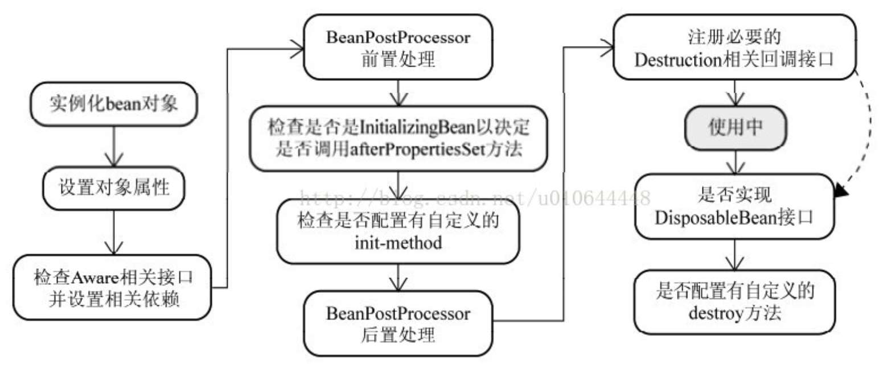

# Spring IOC循环注入问题

>循环依赖，构造器注入依赖的方式会出现

```java
@Component
public class ObjectA {

    @Autowired
    private ObjectB objectB;

    public ObjectA(ObjectB objectB) {
        this.objectB = objectB;
    }
}

@Component
public class ObjectB {

    @Autowired
    private ObjectA objectA;

    public ObjectB(ObjectA objectA) {
        this.objectA = objectA;
    }
}

The dependencies of some of the beans in the application context form a cycle:

┌─────┐
|  objectA defined in file [/Users/hyuan/IdeaProjects/demo/those-bug-sample/target/classes/cn/zerohy/bug/ioc/ObjectA.class]
↑     ↓
|  objectB defined in file [/Users/hyuan/IdeaProjects/demo/those-bug-sample/target/classes/cn/zerohy/bug/ioc/ObjectB.class]
└─────┘
```





