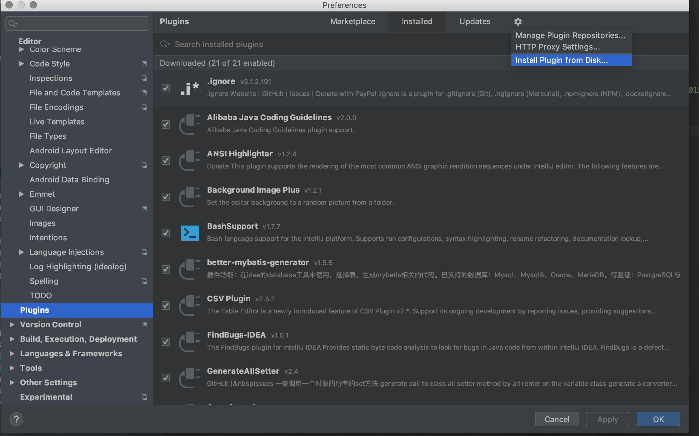
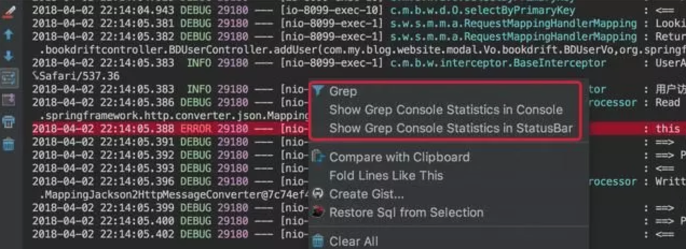
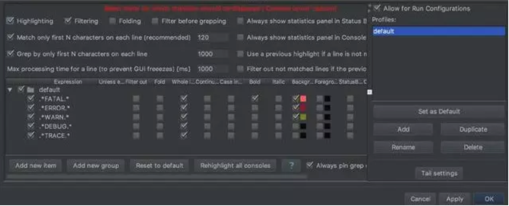
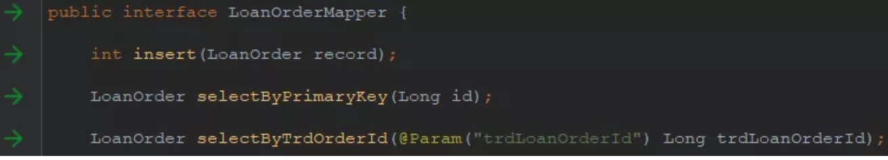
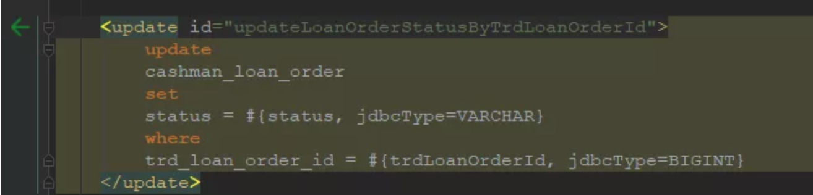
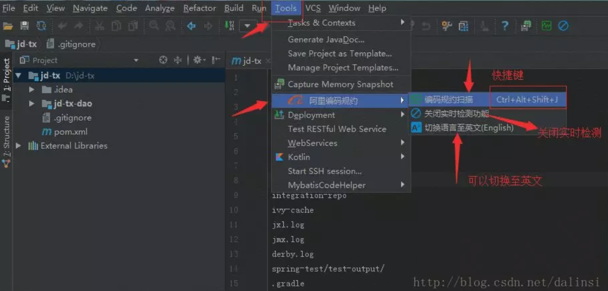
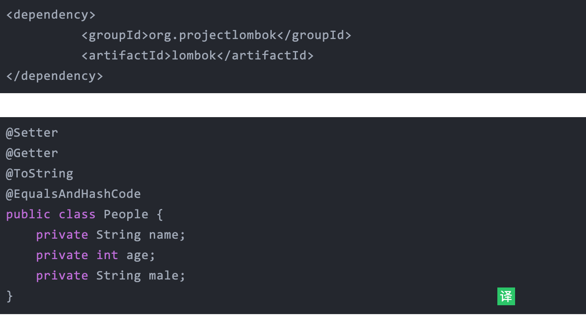
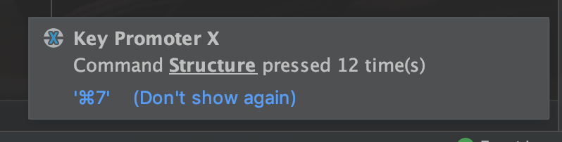

#idea中好用的插件及常用快捷键

**插件的安装**

 打开设置选择Plugins选项

- Ctrl + Alt + S
- File -> Setting

## **Grep console**

自定义日志颜色，idea控制台可以彩色显示各种级别的log，安装完成后，在console中右键就能打开。

并且可以设置不同的日志级别的显示样式。

## **Free Mybatis plugin**

mybatis 插件，让你的mybatis.xml像java代码一样编辑。我们开发中使用mybatis时时长需要通过mapper接口查找对应的xml中的sql语句，该插件方便了我们的操作。

安装完成重启IDEA之后，我们会看到code左侧或多出一列绿色的箭头，点击箭头我们就可以直接定位到xml相应文件的位置。

## **Alibaba Java Coding Guidelines**

阿里巴巴代码规范检查插件，当然规范可以参考《阿里巴巴Java开发手册》。

## aixcoder

## Http Client

## Lombok

Java语言，每次写实体类的时候都需要写一大堆的setter，getter，如果bean中的属性一旦有修改、删除或增加时，需要重新生成或删除get/set等方法，给代码维护增加负担，这也是Java被诟病的一种原因。Lombok则为我们解决了这些问题，使用了lombok的注解(@Setter,@Getter,@ToString,@@RequiredArgsConstructor,@EqualsAndHashCode或@Data)之后，就不需要编写或生成get/set等方法，很大程度上减少了代码量，而且减少了代码维护的负担。

安装完成之后，在应用Lombok的时候注意别忘了需要添加依赖，maven为例：

## **Key promoter**

Key promoter 是IntelliJ IDEA的快捷键提示插件，会统计你鼠标点击某个功能的次数，提示你应该用什么快捷键，帮助记忆快捷键，等熟悉了之后可以关闭掉这个插件。

## 快捷键

见附件文档 IntelliJIDEA_ReferenceCard.pdf

