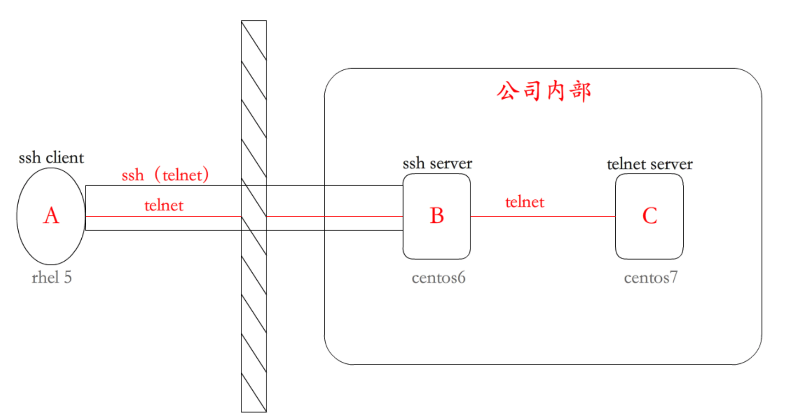
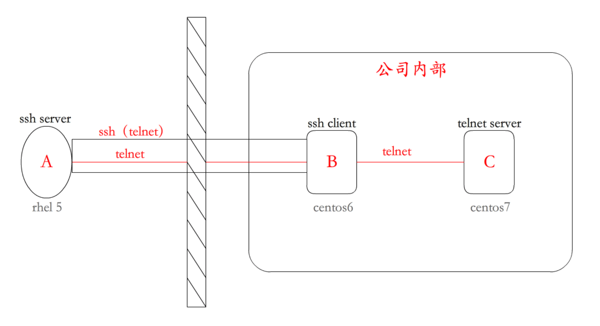

# ssh端口转发及其在开发中的应用

> SSH会自动加密和解密所有SSH客户端与服务端之间的网络数据。但是，SSH还能够将其他TCP端口的网络数据通SSH链接来转发，并且自动提供了相应的加密及解密服务。这一过程也被叫做"**隧道**"（tunneling），这是因为SSH为其他TCP链接提供了一个安全的通道来进行传输而得名。例如，Telnet ，SMTP ，LDAP这些TCP应用均能够从中得益，避免了用户名，密码以及隐私信息的明文传输。而与此同时，如果工作环境许中的防火墙限制了一些网络端口的使用，但是允许SSH的连接，也能够将通过将TCP用端口转发来使用SSH进行通讯。

## 本地端口转发

- **背景：**企业内部C服务器只允许telnet连接（23端口）访问，不允许外部直接访问，B服务器是一个ssh服务器；有一个用户需要从外部连接到企业内部的C服务器。

- **前提：**防火墙允许22端口进来（或者企业内部有一个堡垒机，ssh -t通过堡垒机进去）。

- **原理：**A用户通过ssh协议连接到B机器上，再通过B机器做跳板，连接至C机器。

- **机器：**rhel5模拟A用户，centos6模拟B机器，centos7模拟C机器

- **操作：**建立本地转发的隧道（rhel5上输入以下命令）：

  **ssh -L 9527:192.168.191.77:23 -fN 192.168.191.66**

  

## 远程端口转发

- **背景：**企业内部C服务器只允许telnet连接（23端口）访问，不允许外部直接访问，B服务器是一个ssh服务器；有一个用户需要从外部连接到企业内部的C服务器。
- **原理：**B机器访问A用户，给A用户转发
- **机器：**rhel5模拟A用户，centos6模拟B机器，centos7模拟C机器
- **操作：** 在B机器上输入  **ssh -R sshserverport:remotehost:remotehostport sshserver**

## 动态转发

- **背景：**模拟Google的服务器C不允许国内网站A直接访问，B服务器是国外的一个小型的学习用的服务器；国内网站A可以访问国外学习服务器B；实现国内网站A访问模拟Google服务器C。
- **原理：**国内机器A通过ssh协议连接到国外学习服务器B上，再通过国外学习服务器B做跳板，转发A机器的网络请求，从而连接至Google服务器C。
- **机器：**centos6模拟国内网站A，rhel5模拟国外学习服务器B，centos7模拟Google服务器C
- **操作：**A机器上输入  **ssh -D 1080 -fN 192.168.191.55**、A机器上设置代理，然后就可以请求任意B服务器能够访问的地址。

