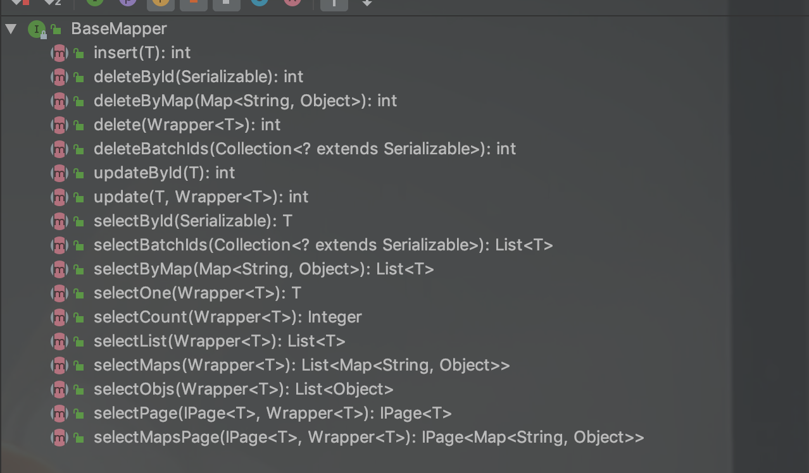

# MyBatis-Plus — MyBatis的增强工具

## 代码生成器

> AutoGenerator 是 MyBatis-Plus 的代码生成器，通过 AutoGenerator 可以快速生成 Entity、Mapper、Mapper XML、Service、Controller 等各个模块的代码，极大的提升了开发效率。


## 通用Mapper




## 条件构造器

```java
    /**
     * 查询表达式
     */
    @Test
    public void query() {
        LambdaQueryWrapper<WechatRecord> queryWrapper = Wrappers.<WechatRecord>lambdaQuery()
                .select(WechatRecord::getAmount, WechatRecord::getPaymentType)
                .eq(WechatRecord::getPaymentType, "收入")
                .le(WechatRecord::getAmount, 1000)
                .last("limit 10");
        //返回domain
        List<WechatRecord> wechatRecordList = wechatRecordMapper.selectList(queryWrapper);
        wechatRecordList.forEach(System.out::println);
        //以map形式返回
        List<Map<String, Object>> maps = wechatRecordMapper.selectMaps(queryWrapper);
        maps.forEach(System.out::println);
    }
```


## 分页插件


## 通用枚举


> - 枚举实现IEnum接口
> - 使用@EnumValue注解枚举的字段

```java
//方式一
public enum AccountTypeEnum implements IEnum<String> {

    //普通账户
    DEBIT,
    //信用账户，可以投资的
    CREDIT,
    //理财账户
    INVERSTMENT;

    @Override
    public String getValue() {
        return this.name();
    }
}

//方式二
public enum GradeEnum {

    PRIMARY(1, "小学"),  SECONDORY(2, "中学"),  HIGH(3, "高中");

    GradeEnum(int code, String descp) {
        this.code = code;
        this.descp = descp;
    }

    @EnumValue//标记数据库存的值是code
    private final int code;
    //。。。
}

```


## 自动填充

> - 实现元对象处理器接口：com.baomidou.mybatisplus.core.handlers.MetaObjectHandler
> - 注解填充字段 `@TableField(.. fill = FieldFill.INSERT)` 生成器策略部分也可以配置！

```java
@Component
@Slf4j
public class MyMetaObjectHandler implements MetaObjectHandler {
    @Override
    public void insertFill(MetaObject metaObject) {
        this.setInsertFieldValByName("createTime", LocalDateTime.now(), metaObject);
    }

    @Override
    public void updateFill(MetaObject metaObject) {
        this.setUpdateFieldValByName("updateTime", LocalDateTime.now(), metaObject);
    }
}

@Data
public class BaseEntity {

    @TableId
    private Long id;

    @TableField(fill = FieldFill.INSERT)
    private LocalDateTime createTime;
    @TableField(fill = FieldFill.INSERT_UPDATE)
    private LocalDateTime updateTime;
}
```


## 逻辑删除

> 逻辑删除是为了方便数据恢复和保护数据本身价值等等的一种方案，但实际就是删除，在系统层面来说删除的数据是不存在的，只是数据库物理层面上仍然存在。

```java
@Data
@ToString(callSuper = true)
@EqualsAndHashCode(callSuper = true)
@Accessors(chain = true)
@TableName("std_account")
public class Account extends BaseEntity {

    private static final long serialVersionUID = 1L;

    @TableField("name")
    private String name;

    @TableField("type")
    private AccountTypeEnum type;

    @TableField(value = "is_deleted",fill = FieldFill.INSERT)
    @TableLogic
    private Integer isDeleted;

}
		@Test
    public void delete() {
        Long id = 1154034308121382914L;
        Account account = accountMapper.selectById(id);
        System.out.println(account);
        accountMapper.deleteById(id);
        Account newAccount = accountMapper.selectById(id);
        System.out.println(newAccount);
    }
//查询、删除对应的SQL语句如下
//SELECT id,name,type,is_deleted,create_time,update_time FROM std_account WHERE id=? AND is_deleted=0 
//UPDATE std_account SET is_deleted=1 WHERE id=? AND is_deleted=0 
//SELECT id,name,type,is_deleted,create_time,update_time FROM std_account WHERE id=? AND is_deleted=0 


```


## 乐观锁

> 悲观锁(Pessimistic Lock), 顾名思义，就是很悲观，每次去拿数据的时候都认为别人会修改，所以每次在拿数据的时候都会上锁，这样别人想拿这个数据就会block直到它拿到锁。传统的关系型数据库里边就用到了很多这种锁机制，比如行锁，表锁等，读锁，写锁等，都是在做操作之前先上锁。


> 乐观锁(Optimistic Lock), 顾名思义，就是很乐观，每次去拿数据的时候都认为别人不会修改，所以不会上锁，但是在更新的时候会判断一下在此期间别人有没有去更新这个数据，可以使用版本号等机制。乐观锁适用于多读的应用类型，这样可以提高吞吐量，像数据库如果提供类似于write_condition机制的其实都是提供的乐观锁。

 

> 两种锁各有优缺点，不可认为一种好于另一种，像乐观锁适用于写比较少的情况下，即冲突真的很少发生的时候，这样可以省去了锁的开销，加大了系统的整个吞吐量。但如果经常产生冲突，上层应用会不断的进行retry，这样反倒是降低了性能，所以这种情况下用悲观锁就比较合适。


> MyBatia-Plus的做法：
>
> 当要更新一条记录的时候，希望这条记录没有被别人更新
>
> 乐观锁实现方式：
>
> - 取出记录时，获取当前version
> - 更新时，带上这个version
> - 执行更新时， set version = newVersion where version = oldVersion
> - 如果version不对，就更新失败


